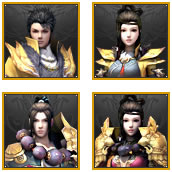

# 畅易阁APP
> 1. 变量名采用匈牙利命名法
2. 版本1.0目标
	- [ ] 实现`无条件查询`信息的展示，包括：门派性别的头像、门派、性别、等级、角色名、是否有重楼、装备评分、修炼评分、进阶评分；
	- [ ] 上拉加载20条；
	- [ ] 

### 1. ul源码---采集于`2015年8月14号`
```html
<ul class="pg-goods-list" id="J_good_list">
	<li class="role-item first odd">
		<span class="item-img">
			<a target="_blank" href="http://tl.cyg.changyou.com/goods/char_detail?serial_num=20150801954285459" class="r-img pro3-1"></a>
		</span>
		<dl class="item-info">
			<dt class="title">
				<a href="http://tl.cyg.changyou.com/goods/char_detail?serial_num=20150801954285459" target="_blank">
					<span class="name">[武当 男 119级]</span>
					EmperoR
				</a>
				<i class="icon-cl" title="该角色拥有重楼装备">&nbsp;</i>
			</dt>
			<dd class="detail">
				<span class="di">装备评分：<b>706790</b></span>
				<i class="ds">|</i>
				<span class="di">修炼评分：<b>5480</b></span>
				<i class="ds">|</i>
				<span class="di">进阶评分：<b>3720</b></span>
			</dd>
			<dd class="server-and-time">
				<span class="server-info" data-wordId="5040" title="">游戏区服：加载中...</span>
				<p class="time">剩余时间：07天22小时57分钟</p>
			</dd>
		</dl>
		<div class="item-opr">
			<p class="price">￥160000</p>
			<p>
				<a class="btn-buy-small" href="http://tl.cyg.changyou.com/goods/char_detail?serial_num=20150801954285459" target="_blank">
					<span class="span">立即购买</span>
				</a>
			</p>
		</div>
	</li>
</ul>
```

### 2. 获取html源代码，然后转为dom对象，接着通过id找到ul列表，然后得到20个li对象`aItem`。
```javascript
var aItems = new Array();	//此数组存储所有aItem数据
function analysis(str) {	//str为html源代码
	var oParser = new DOMParser();
	var oText = oParser.parseFromString(str, "text/html");
	var oUl = oText.getElementById("J_good_list");
	var aItem = oUl.getElementsByTagName("li");
}
```

### 3. 从`aItem`数组中循环分析每个元素得到账号简略信息。
* 关于头像
	
```javascript
	for (var i=0; i<20; i++) {
		var jsItem = {
			imgcss: "",			//头像类
			serial_num: "",		//商品号
			group: "",			//门派
			sex: "",			//性别
			grade: "",			//等级
			name: "",			//角色名
			cl: "",				//bool，重楼
			score_equipment: "",//装备评分
			score_practice: "",	//修炼评分
			score_advanced: ""	//进阶评分
		};
		//得到商品号，18位或17位
		jsItem.serial_num = aItem[i].getElementsByTagName("a")[0].href.split("=")[1];
		//门派+性别+等级
		
	}
```

### 角色详情
* good-info
	* info-list
		* 商品号
		* 角色名称
		* 所在区服
		* 价格
		* 剩余时间
	* goods-opr 关注、购买
* good-content
	* tab_0 角色
		* 角色装备
	* tab_1 技能
	* tab_2 秘籍
	* tab_3 珍兽
	* tab_4 包裹仓库
	* tab_5 武魂
	* tab_6 修炼经脉
	* tab_7 真元
	* tab_8 子女
	* tab_9 神鼎
