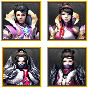
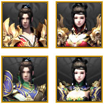
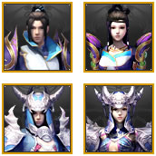
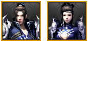

# 畅易阁APP
> 1. 变量名采用匈牙利命名法
2. 版本1.0目标
	- [x] 实现`无条件查询`信息的展示，包括：门派性别的头像、门派、性别、等级、角色名、是否有重楼、装备评分、修炼评分、进阶评分、价格；
	- [ ] 上拉加载20条；
	- [ ] 

##主界面部分

### 数据挖掘

#### 1. ul源码---采集于`2015年8月14号`
```html
<ul class="pg-goods-list" id="J_good_list">
	<li class="role-item first odd">
		<span class="item-img">
			<a target="_blank" href="http://tl.cyg.changyou.com/goods/char_detail?serial_num=20150801954285459" class="r-img pro3-1"></a>
		</span>
		<dl class="item-info">
			<dt class="title">
				<a href="http://tl.cyg.changyou.com/goods/char_detail?serial_num=20150801954285459" target="_blank">
					<span class="name">[武当 男 119级]</span>
					EmperoR
				</a>
				<i class="icon-cl" title="该角色拥有重楼装备">&nbsp;</i>
			</dt>
			<dd class="detail">
				<span class="di">装备评分：<b>706790</b></span>
				<i class="ds">|</i>
				<span class="di">修炼评分：<b>5480</b></span>
				<i class="ds">|</i>
				<span class="di">进阶评分：<b>3720</b></span>
			</dd>
			<dd class="server-and-time">
				<span class="server-info" data-wordId="5040" title="">游戏区服：加载中...</span>
				<p class="time">剩余时间：07天22小时57分钟</p>
			</dd>
		</dl>
		<div class="item-opr">
			<p class="price">￥160000</p>
			<p>
				<a class="btn-buy-small" href="http://tl.cyg.changyou.com/goods/char_detail?serial_num=20150801954285459" target="_blank">
					<span class="span">立即购买</span>
				</a>
			</p>
		</div>
	</li>
</ul>
```

#### 2. 获取html源代码，然后转为dom对象，接着通过id找到ul列表，然后得到20个li对象`aItem`。
```javascript
var aItems = new Array();	//此数组存储所有aItem数据
function analysis(str) {	//str为html源代码
	var oParser = new DOMParser();
	var oText = oParser.parseFromString(str, "text/html");
	var oUl = oText.getElementById("J_good_list");
	var aItem = oUl.getElementsByTagName("li");
}
```

#### 3. 从`aItem`数组中循环分析每个元素得到账号简略信息。
* 关于头像

|            头像             |  文件名	 | 					          background-position                                  |
| :-------------------------: | :------: | :-----------------------------------------------------------------------------: |
 | pro1.jpg | TL男：-5px -5px <br>TL女：-95px -5px <br>SL男：-5px -95px <br>SL女：-95px -95px |
 | pro2.jpg | EM男：-5px -5px <br>EM女：-95px -5px <br>TS男：-5px -95px <br>TS女：-95px -95px |
 | pro3.jpg | GB男：-5px -5px <br>GB女：-95px -5px <br>WD男：-5px -95px <br>WD女：-95px -95px | 
 | pro4.jpg | MJ男：-5px -5px <br>MJ女：-95px -5px <br>XY男：-5px -95px <br>XY女：-95px -95px |
 | pro5.jpg | MR男：-5px -5px <br>MR女：-95px -5px <br>XX男：-5px -95px <br>XX女：-95px -95px |
      | pro6.jpg | TM男：-5px -5px <br>TM女：-95px -5px                                            |

* 实现

```javascript
	for (var i=0; i<20; i++) {
		var jsItem = {
			imgcss: "",			//头像类{.proi-j}i：0少林 1明教 2丐帮 3武当 4峨眉 5星宿 6天龙 7天山 8逍遥 10慕容 11唐门；j：0女 1男
			serial_num: "",		//商品号
			group: "",			//门派
			sex: "",			//性别
			grade: "",			//等级
			name: "",			//角色名
			cl: "",				//bool，重楼
			score_equipment: "",//装备评分
			score_practice: "",	//修炼评分
			score_advanced: "",	//进阶评分
			price: ""			//价格
		};
		//头像类可根据原网页得到，或者根据门派+性别自行判断，其中r-img规定图片大小72*72
		jsItem.imgcss = aItem[i].getElementByTagName("a")[0].className;
		//得到商品号，18位或17位
		jsItem.serial_num = aItem[i].getElementsByTagName("a")[0].href.split("=")[1];
		//门派+性别+等级
		var sGsg = aItem[i].getElementsByTagName("span")[1].innerHTML;
		var aGSG = sGsg.slice(1, sGsg.length-1).split(" ");
		jsItem.group = aGSG[0];
		jsItem.sex = aGSG[1];
		jsItem.grade = aGSG[2];
		//角色名
		jsItem.name = aItem[i].getElementsByTagName("a")[1].lastChild.nodeValue;
		//重楼
		jsItem.cl = aItem[i].querySelector(".icon-cl") ? true : false;
		//评分
		var aScore = aItem[i].getElementsByTagName("b");
		jsItem.score_equipment = aScore[0].innerHTML;
		jsItem.score_practice = aScore[1].innerHTML;
		jsItem.score_advanced = aScore[2].innerHTML;
		//价格
		jsItem.price = aItem[i].getElementsByTagName("p")[1].innerHTML;
	}
```

### 界面实现
#### 1. 素材收集
* 奇数条目背景色`#FFFBE4`，偶数条目背景色`#FAF2D4`；
* 条目边框颜色`#F0D895`；
* 各门派头像的雪碧图；
* 重楼样式


## 角色详情


---
#### 如果您觉得本文的内容对您有所帮助，您可以支付宝(左)或微信(右)：


